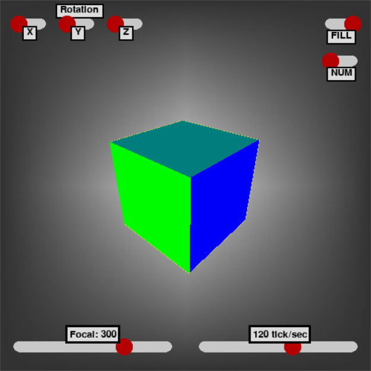

# Py3DCubeRenderer
Outil de rendu d'un cube en 3D



## Auteurs
 - Guilhem Mazoyer, [Portfolio](https://guilhem.iruka.fr)

## Installation

### Python3

Ce programme est écrit en [python3](https://www.python.org/downloads/).

### Librairies

PyGame :
```
pip install pygame
```

PyGameWidgets :
```
pip install pygame-widgets
```

## Utilisation

Toutes les fonctionnalités disponible pour le cube sont modifiables depuis l'interface de l'application.
```
python ./main.py
```

### Options
L'interface permet de choisir comment le cube varie sur l'écran :
- Axe de rotation, le cube peut pivote sur les trois axes xyz. Ils peuvent être activé simultanément.
- Remplissage, en activant l'option "FILL", les faces du cube seront remplies. Chaque face à une couleur distinctes pour faciliter la lisibilité de l'animation.
- Nombre, en activant l'option "NUM", un chiffre apparait au niveau de chaque sommet du cube et y reste accroché.
- Distance focal, pour afficher le cube simulé dans un espace 3D sur un écran en 2D il faut projeter le cube. Ainsi la distance en la caméra factice et l'écran est égale à la distance focale. Il est donc possible d'avancer ou reculer la caméra de l'écran.
- Tick, cette dernière option permet de choisir la vitesse d'execution du processus.

## Fonctionnement
L'idée de faire ce cube vient d'une vidéo où un jeune youtuber anglophone fait un rendu d'un cube en 3D sur minecraft : [lien](https://youtu.be/hFRlnNci3Rs). J'ai donc souhaité réaliser la même chose via un language de programation, ici python. J'ai ensuite poussé le projet un peu plus loin en faisant l'affichage des faces du cube pour améliorer le rendu. J'ai, dans la mesure du possible, utiliser mes propres méthodes, pour comprendre le fonctionnement de chaque étape sans me reposer sur des choses que je ne comprends pas.

### Arrêtes
Pour afficher les arrêtes, j'ai passé en paramètre 2 tables renseignant les sommets et les arrêtes du cube. Les lignes sont composés des index des points. J'ai trouvé plus simple de tout faire fonctionné autours de l'indexation des points pour définir les arrêtes et plus tard les faces.
Pour afficher les arrêtes du cube il faut projetter le cube de l'espace 3D sur l'écran en 2D. Pour celà il faut projeter chaque sommet sur le plan en fonction de la position de la caméra.
#### Projection : [https://fr.wikipedia.org/wiki/Projection_orthogonale](https://fr.wikipedia.org/wiki/Projection_orthogonale)
Ainsi pour obtenir la position d'un sommet $(x,y,z)$ sur le plan on doit faire :
<br/>$x_{1}=\frac{focal*x}{focal+z}$ et $y_{1}=\frac{focal*y}{focal+z}$ <br/>
Une fois les 8 sommets calculés on peut les relier 2 à 2 selon les valeurs stockées dans la table des arrêtes.

### Rotation
Pour effectuer la rotation on doit multiplier le sommet, vue comme une matrice, par une matrice de rotation.
#### Matrice de rotation : [https://fr.wikipedia.org/wiki/Matrice_de_rotation](https://fr.wikipedia.org/wiki/Matrice_de_rotation)
On peut donc effectuer, à chaque exécution de la boucle, une rotation de chaque sommet du cube. La rotation s'effectue sur l'axe x, y ou z. pour celà on effectue :
<br/>$x(yz)=
\begin{pmatrix}{y}&{z}\\\end{pmatrix}.
\begin{pmatrix}{\cos\theta}&{-\sin\theta}\\{\sin\theta}&{\cos\theta}\\\end{pmatrix}$ &emsp;&emsp;
$y(xz)=\begin{pmatrix}{x}&{z}\\\end{pmatrix}.
\begin{pmatrix}{\cos\theta}&{-\sin\theta}\\{\sin\theta}&{\cos\theta}\\\end{pmatrix}$ &emsp;&emsp;
$z(xy)=\begin{pmatrix}{x}&{y}\\\end{pmatrix}.
\begin{pmatrix}{\cos\theta}&{-\sin\theta}\\
{\sin\theta}&{\cos\theta}\\\end{pmatrix}$<br/>

Cette opération donne la nouvelle position du point dans l'espace 3D, il faut ensuite projeter le sommet sur le plan et retracer les arrêtes de l'étape précédente.

### Faces
Pour remplir les faces j'ai utilisé une méthode de pygame, drawPolygon. Pour utiliser cette méthode il faut fournir les points composants le polygon. Pour celà je récupère les index de la table des faces, où pour chaque face est associé 4 sommets. Je projète chaque sommet sur le plan puis trace les polygons en fonction des valeurs obtenues. Enfin, un dernier problème me séparait de la réalisation du projet. Pour afficher les bonnes faces du cube et pas les faces situés dans le fond, il faut organiser les faces à faire apparaitre pour faire apparaître sur l'écran les faces visibles. Pour celà j'ai fais la moyenne de la valeur Z de chaque sommet composant une face, Z étant la profondeur, en rangeant ces valeurs dans une liste croissante, on obtient les faces rangés selon leur distance à l'écran. On peut donc sélectionner dans cette liste les faces à afficher et dans quel ordre le faire. 
